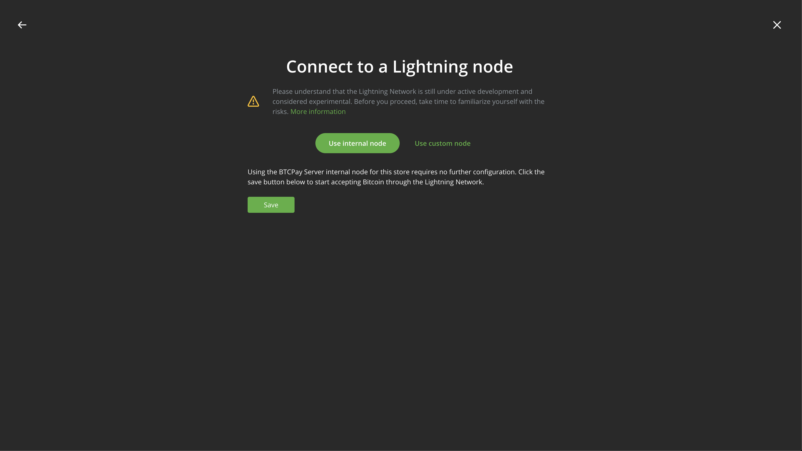

# Using BTCPay Server

## Key Information

The instance of BTCPay Server running on your Start9 server is your *own*, self-hosted payment processor for Bitcoin, including Bitcoin over the Lightning Network. The interface is served from your server alone - you are not trusting a third party to store your data and serve content. All information lives on your server.

This service provides an enormous amount of functionality surrounding creating stores, generating invoices, and accepting payments. Please visit the visit the official [documentation](https://docs.btcpayserver.org/Guide/) for details on the full capabilities.

Using the Shopify plugin will only work over Tor (ie. Shopify users will be redirected to an onion address when submitting payment) unless you set up a reverse proxy to Tor. See more details in the Advanced section below. 

## Creating your Account

When you visit your BTCPay Server for the first time, you will be asked to create an account - this will be the admin user account. Note, *you are creating an account with yourself* - there are no third parties involved storing your password on a remote server. The password is stored on your server in the BTCPay Server database and is not editable from the service config page. Please save this password in a password manager, such as Bitwarden.

By default, additional registrations are disabled. This means that once you create an account, no one else will be permitted to create an account on your instance. The admin user can add additional accounts under `Server settings > Users`.

Registrations can be enabled under `Server settings > Policies`, or by using the "Enable Registrations" action from the StartOS service details page.

## Configuring Email

Email configuration is recommended for:

1. Enabling the optimal password reset flow for all users
1. Receiving invoice/payment notifications
1. Capturing store related events, such as sending invoices.

Since you are running your own instance, if you want to receive email notifications, you will have to send them yourself. This can be done from your own SMTP server, or by using an account with a hosted SMTP server, such as Yahoo, Mailgun, Office365, SendGrid, etc. For specific instructions on how to configure these settings, please visit the official [documentation](https://docs.btcpayserver.org/Notifications/#smtp-email-setup).

## Forgot Password

If you forget your BTCPay Server admin password and you have email configured, please follow the "Forgot password" flow when attempting to login.

If you forgot your BTCPay Server admin password and you *do not* have email configured, please use the "Reset Admin Password" StartOS action on your service details page to create a temporary password. **Do not forget** to change your password once logged in!

If you forgot your BTCPay Server password and you are not an admin user, please attempt to use the "Forgot password" flow when attempting to login. If you do not receive an email, reach out to your account admin so they can check or setup the email configuration.

## Enabling Lightning

**Important**

BTCPay Server is compatible with multiple lightning implementations, including the ones running on your Start9 server. These are called "Internal Nodes" in BTCPay. To begin using Lightning, your Bitcoin blockchain needs to be fully synced.

Please follow the instructions below to enable lightning using the nodes running on your server:

First, connect your **Start9 server's lightning node** to BTCPay Server:

1. Open your BTCPay Server service details page and select `Config`. 
1. Navigate to `Lightning Node` and select the installed lightning implementation type you would like to use for BTCPay (ie. LND or CLN).
1. Save this setting.

Next, **enable lightning** for a particular store's wallet using the connection to your server's lightning node:

1. Select a store from the top of the menu.
1. Navigate to `Wallets >  Lightning`. 
1. On the page entitled "Connect to a Lightning node", select "Use internal node"
1. Click "Save".
1. That's it!

<!-- MD_PACKER_INLINE BEGIN -->

<!-- MD_PACKER_INLINE END -->

If you would like to connect to an external lightning node, select "Use custom node" when on the page above and follow the instructions.

## Enabling Altcoins

In config, find `Altcoin Integrations` and set the desired altcoin implemtation to "Enabled".

### Monero

This service can be installed on your server from the Community Marketplace and enabled in config by setting `Altcoin Integrations > Monero` to "Enabled".

#### Wallet

Enabling Monero requires manual wallet setup. Fortunately, the community has put together some great guides to get this setup:

- [SethForPrivacy Guide](https://sethforprivacy.com/guides/accepting-monero-via-btcpay-server/#setup-your-bitcoin-and-monero-wallets)
- [Freedom Node Guide](https://freedomnode.com/blog/howto-accept-monero-for-your-services-btcpayserver/#create-a-view-only-monero-wallet-with-feather)

Using these guides, setup a Feather wallet (recommended), then proceed to upload the wallet to BTCPay Server for your store by opening the store settings and finding the "Monero" tab across the top menu bar. The Monero node will need to be fully synced before it is available to use in BTCPay Server.

If you are unable to open Feather on macOS, go to System Settings > Privacy & Security and scroll to find where "Feather" was blocked becuase it is not from an identified developer > "Open Anyway" > Enter password > Select "Open" regardless of security warning.

#### RPC

If you enable / disable RPC credentials in Monero, you will need to restart BTC Pay Server to pick up this change.

## Setting up BTCPayServer Vault

BTCPayServer Vault supports hardware wallet integrations for stores. To use, you must [install Vault](https://github.com/btcpayserver/BTCPayServer.Vault/releases) and run it on a laptop/desktop machine. Then, access your BTCPay Server service in a browser on the same device. 

To reconfigure an existing store, open the BTCPay Server UI, select the store, navigate to `Wallets > Bitcoin`, and select the settings gear in the top right corner. Under `BTC Wallet Settings`, select `Actions > Replace Wallet`, confirm the action, and click "Setup new wallet". Finally, follow the on-screen instructions to "Connect an existing wallet".

When creating a new store, select `Wallets > Bitcoin > Set up a wallet > Connect an existing wallet > Connect hardware wallet` and follow the on-screen instructions. 

Check out the official [documentation](https://docs.btcpayserver.org/Vault/) and [blog post](https://blog.btcpayserver.org/btcpay-vault/) for more information. 

## Updates

Manual maintenance updates are disabled. Updates for BTCPay Server will be delivered through the Start9 Marketplace.

## Advanced

The BTCPay Server documentation can recommend `ssh` or `docker-compose` commands for resolving issues. The way BTCPay Server is configured for your Start9 server is different than the default installation, which is meant to run on a standalone server instance. Start9 has consolidated BTCPay Server to run in an optimal way, so please reach out to the Start9 team for support in these circumstances. Adding an SSH key to your device to manually debug voids the warranty and Start9 cannot assure that operations will continue to function as intended. 

### Setting up a reverse proxy

Clearnet support for BTCPay Sever will be made accessible in a future release of StartOS. In the meantime, you can configure a reverse TOR proxy by following the official guide [here](https://docs.btcpayserver.org/Deployment/ReverseProxyToTor/#reverse-proxy-to-tor).

Enabling this functionality allows external applications and plugins to use a hosted clearnet address to access the BTCPay Server instance running on your device. This is useful if an external application requires a clearnet address to operate. Please only attempt this setup if you know what you are doing.